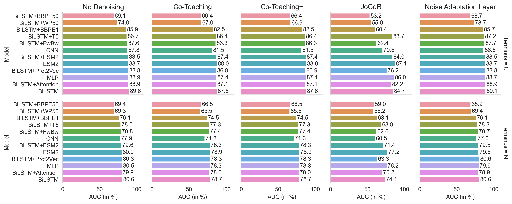
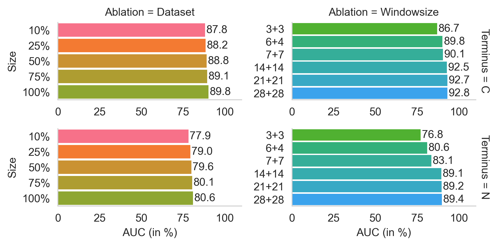

# Cleavage Prediction Benchmark

This repository contains the code and dataset for the paper "Proteasomal cleavage prediction: state-of-the-art and future directions".

## Abstract
>Epitope vaccines are a promising approach for precision treatment of pathogens, cancer, autoimmune diseases, and allergies. Effectively designing such vaccines requires accurate proteasomal cleavage prediction to ensure that the epitopes included in the vaccine trigger an immune response. The performance of proteasomal cleavage predictors has been steadily improving over the past decades owing to increasing data availability and methodological advances. In this review, we summarize the current proteasomal cleavage prediction landscape and, in light of recent progress in the field of deep learning, develop and compare a wide range of recent architectures and techniques, including long short-term memory (LSTM), transformers, and convolutional neural networks (CNN), as well as four different denoising techniques. All open-source cleavage predictors re-trained on our dataset performed within two AUC percentage points. Our comprehensive deep learning architecture benchmark improved performance by 1.7 AUC percentage points, while closed-source predictors performed considerably worse. We found that a wide range of architectures and training regimes all result in very similar performance, suggesting that the specific modeling approach employed has a limited impact on predictive performance compared to the specifics of the dataset employed. We speculate that the noise and implicit nature of data acquisition techniques used for training proteasomal cleavage prediction models and the complexity of biological processes of the antigen processing pathway are the major limiting factors. While biological complexity can be tackled by more data and, to a lesser extent, better models, noise and randomness inherently limit the maximum achievable predictive performance.

## Repository Structure
* `data/` holds the `.csv` and `.tsv` train, evaluation, and test files, as well as a vocabulary file
* `params/` holds vocabulary and tokenization merges files
* `code/` contains all of the preparation, training, evaluation, and runtime configuration files
    * `run_configs/` contains all possible argparse configs to execute training
    * `args.py` holds all argparse options 
    * `denoise.py` implements the tested denoising methods
    * `loaders.py` defines the dataloaders for all subsequent training architectures
    * `models.py` implements all tested model architectures
    * `prep_dataset.py` shows how we split and prepared the raw data
    * `processors.py` implements the training loops for all architecture and denoising variants
    * `run_train.py` is the overall training script that takes the argparse options and executes training and evaluation
    * `train_tokenizers.py` is used to create the vocab and merges files under `params/`
    * `utils.py` features utility functions such as masking

### Naming structure of runtime configs
* All config files are named as follows: the applicable terminal, i.e. `c` or `n`, followed by the model architecture, e.g. `bilstm`, followed by the denoising method, e.g. `coteaching`
* Example: `c_bilstm_coteaching.cfg`

#### Available model architectures
* BiLSTM, called `bilstm`
* BiLSTM with Attention, called `bilstm_att`
* BiLSTM with pre-trained Prot2Vec embeddings, called `bilstm_prot2vec`
* Attention enhanced CNN, called `cnn`
* BiLSTM with ESM2 representations as embeddings, called `bilstm_esm2`
* Fine-tuning of ESM2, called `esm2`
* BiLSTM with T5 representations as embeddings, called `bilstm_t5`
* Base BiLSTM with various trained tokenizers
    * Byte-level byte-pair encoder with vocabulary size 1000 and 50000, called `bilstm_bppe1` and `bilstm_bbpe50`
    * WordPair tokenizer with vocabulary size 50000, called `bilstm_wp50`
* BiLSTM with forward-backward representations as embeddings, called `bilstm_fwbw`

#### Available denoising architectures
* Co-Teaching, called `coteaching`
* Co-Teaching+, called `coteaching_plus`
* JoCoR, called `jocor`
* Noise Adaptation Layer, called `nad`
* DivideMix, called `dividemix`

## Achieved performances
### Results of our new architectures benchmarked against themselves, including denoising methods

### Ablation analysis results of our best method, the BiLSTM

### Comparison of our best method, the BiLSTM, to other published methods (in % AUC)

| Method                 	| C-Terminal  	| N-Terminal 	|
|------------------------	|------------	|------------	|
| PCPS                   	| 51.3       	| 50.0       	|
| PCM                    	| 64.5       	| 52.4       	|
| NetChop 3.1 (20S)      	| 66.1       	| 52.7       	|
| NetChop 3.1 (C-term)   	| 81.5       	| 51.0       	|
| SVM\*                   	| 84.8       	| 73.2       	|
| PCM\*                   	| 85.3       	| 75.5       	|
| Logistic Regression\*   	| 86.2       	| 76.2       	|
| NetCleave\*             	| 86.9       	| 76.4       	|
| PUUPL\*                 	| 87.2       	| 78.0       	|
| Pepsickle\*              	| 88.1       	| 78.9       	|
| **Our BiLSTM (6+4)**   	| **89.8**   	| **80.6**   	|
| **Our BiLSTM (28+28)** 	| **92.8**   	| **89.4**   	|

\* Method has been re-trained from scratch on our dataset.

For other methods, we used published pre-trained models (NetChop, PCM), or web-server functionality (PCPS).

## Sources for model architectures and denoising approaches
#### LSTM Architecture
* BiLSTM model architecture based on [Ozols et. al., 2021](https://www.mdpi.com/1422-0067/22/6/3071/htm)

#### LSTM Attention Architecture
* Model architecture based on [Liu and Gong, 2019](https://bmcbioinformatics.biomedcentral.com/counter/pdf/10.1186/s12859-019-3199-1.pdf), [Github](https://github.com/Jiale-Liu/LSTM)

#### CNN Architecture
* Model architecture based on [Li et al., 2020](https://academic.oup.com/bioinformatics/article/36/4/1057/5578482?login=true), Repository available via download section on [Homepage](https://deepcleave.erc.monash.edu/)

#### Prot2Vec Embeddings
* Prot2Vec embeddings based on [Asgari and Mofrad, 2015](https://journals.plos.org/plosone/article?id=10.1371/journal.pone.0141287), available on [Github](https://github.com/ehsanasgari/Deep-Proteomics)

#### FwBw Architecture
* Sequence Encoder model architecture based on [Heigold et al., 2016](https://arxiv.org/abs/1606.06640)

#### MLP Architecture
* Model architecture based on [DeepCalpain, Liu et al., 2019](https://www.frontiersin.org/articles/10.3389/fgene.2019.00715/full) and [Terminitor, Yang et al., 2020](https://www.biorxiv.org/content/10.1101/710699v2)

#### T5 Architecture
* T5 Encoder taken from [Elnagger et al., 2020](https://ieeexplore.ieee.org/document/9477085), [Github](https://github.com/agemagician/ProtTrans), Model on [Huggingface Hub](https://huggingface.co/Rostlab/prot_t5_xl_half_uniref50-enc)

#### ESM2 Architecture
* ESM2 taken from [Lin et al., 2022](https://www.biorxiv.org/content/10.1101/2022.07.20.500902v1), [Github](https://github.com/facebookresearch/esm)

#### Noise Adaptation Layer
* Noise adaptation layer implementation is based on [Goldberger and Ben-Reuven, 2017](https://openreview.net/references/pdf?id=Sk5qglwSl), and unofficial implementation on [Github](https://github.com/Billy1900/Noise-Adaption-Layer)

#### Co-teaching
* Co-teaching loss function and training process adaptations are based on [Han et al., 2018](https://arxiv.org/abs/1804.06872), and official implementation on [Github](https://github.com/bhanML/Co-teaching)

#### Co-teaching+
* Co-teaching+ loss function and training process adaptations are based on [Yu et al., 2019](https://arxiv.org/abs/1901.04215), and official implementation on [Github](https://github.com/xingruiyu/coteaching_plus)

#### JoCoR
* JoCoR loss function and training process adaptations are based on [Wei et al., 2020](https://openaccess.thecvf.com/content_CVPR_2020/html/Wei_Combating_Noisy_Labels_by_Agreement_A_Joint_Training_Method_with_CVPR_2020_paper.html), and official implementation on [Github](https://github.com/hongxin001/JoCoR)

#### DivideMix
* DivideMix structure is based on [Li et al., 2020](https://openreview.net/pdf?id=HJgExaVtwr), [Github](https://github.com/LiJunnan1992/DivideMix)
* As DivideMix was originally implemented for image data, we adjusted the MixMatch and Mixup part for sequential data, based on [Guo et al., 2019](https://arxiv.org/abs/1905.08941)
    * This part is directly implemented in the respective forward pass in the notebooks, and thus cannot be found in the DivideMix section

## Sources for other published methods included in the benchmark
#### PCPS
* [Diez-Rivero et al., 2010](https://doi.org/10.1186/1471-2105-11-479)

#### PCM
* [Dönnes and Kohlbacher, 2005](https://doi.org/10.1110/ps.051352405)

#### NetChop 3.1 (20S and C-term)
* [Kesmir et al., 2002](https://doi.org/10.1093/protein/15.4.287)

#### SVM
* Based around [Pcleavage, Bhasin and Raghava, 2005](https://doi.org/10.1093/nar/gki587)

#### Logistic Regression
* Based around [Tenzer et al., 2005](https://doi.org/10.1007/s00018-005-4528-2)

#### NetCleave
* [Amengual-Rigo and Guallar, 2021](https://doi.org/10.1038/s41598-021-92632-y)

#### PUUPL
* [Dorigatti et al., 2022](https://arxiv.org/abs/2209.07527)

#### Pepsickle
* [Weeder et al., 2021](https://doi.org/10.1093/bioinformatics/btab628), [Github for Package](https://github.com/pdxgx/pepsickle), [Github for Paper](https://github.com/pdxgx/pepsickle-paper)
# Cleavage Benchmark
